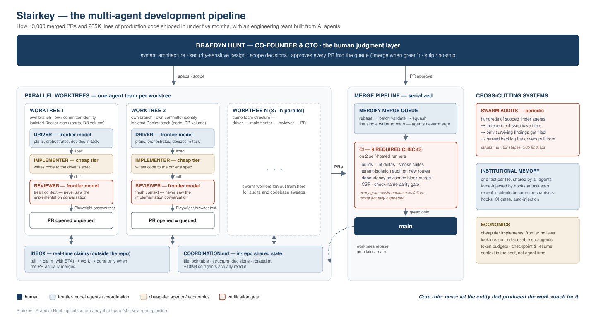

# I shipped a SaaS product with a team of AI agents. Here's the actual system.

*Under five months. ~3,700 commits, ~3,000 merged PRs, 285,000 lines of production code. I didn't
hand-write the code — and this post is about the part I did build: the AI-agent
engineering organization that produced it.*

**[▶ Watch the 4-minute demo](https://youtu.be/mSWxMIRrxJI)** — estimate → invoice →
balanced ledger, the offline contractor portal surviving a dead network, and the
agent pipeline that shipped all of it.

---

I'm a co-founder and the CTO of Stairkey, a business-management platform for construction and
realty companies — CRM, project management, double-entry accounting, construction takeoff
and estimating, and an offline-capable contractor portal. React and Node, SQLite, Docker,
nginx. A real product with real complexity: multi-tenant auth, money math, offline sync,
role-based permissions.

We didn't hire an engineering team to build it: multiple Claude Code agents work the repo
in parallel, around the clock, and my job looks like a CTO's job anywhere — architecture,
review, scope, security, and deciding what ships. The interesting part isn't "AI wrote
code" — everyone's AI writes code now. The interesting part is what it takes to get
**thousands of merged PRs of production quality** out of agents, in parallel, without the
whole thing collapsing into merge conflicts and confident nonsense.

That took building four things: a coordination layer, a merge pipeline, a verification
stack, and institutional memory. This is a tour of each, including what broke.

## The org chart

The mental model that made everything click: **treat the agents like an engineering org,
not like autocomplete.**

- **Me** — architecture, security-sensitive design, scope decisions, final judgment.
  Anything where a miss is unrecoverable stays with me.
- **Driver agents** (frontier model) — one per worktree. They plan, orchestrate, and make
  in-task judgment calls.
- **Implementer agents** (cheaper model) — write the actual feature code to a spec the
  driver writes. Deliberately cheap and replaceable.
- **Reviewer agents** (frontier model, fresh context) — review every non-trivial diff
  before commit. The reviewer has *not* seen the implementation conversation, which is
  exactly the point: it can't inherit the implementer's assumptions.
- **Swarm workers** — hundreds of short-lived agents fanned out for audits and codebase
  sweeps, with structured outputs and adversarial verification stages.

Once you see it as an org, the rest of the system is just the stuff every engineering org
needs: don't step on each other, don't break main, don't trust unverified work, don't
forget what you learned.

## Parallelism without collisions

Each agent works in its own **git worktree** — same repo, separate checkouts, separate
branches, separate git committer identities so every commit self-identifies which agent
made it. Each worktree runs its own isolated Docker stack (separate containers, ports, and
database volumes), because the first time two agents shared a dev database, their test
writes crossed over and both spent an hour debugging data the other one had created.

Worktrees prevent *file-level* stomping, but not *semantic* collisions — two agents
editing the same subsystem on different branches merge cleanly and break logically. That's
a coordination problem, not a git problem.

## The coordination layer

Two channels, deliberately split by latency:

- **`COORDINATION.md`** — committed to the repo. Slow-moving shared state: active agents,
  a file lock table for conflict-prone files (the app shell, the server entrypoint, the DB
  schema), structural decisions. Changes go through PRs, so it lags by design.
- **An inbox** — a tiny message-passing script outside the repo. Real-time: claims,
  releases, heads-ups. This is the channel that actually prevents collisions.

The inbox protocol is four verbs, and it is the one rule with no exceptions:

1. **Tail** the inbox immediately before starting any task — not "earlier in the
   session," immediately before. A claim you read twenty minutes ago is stale.
2. **Claim** the area with an ETA *before* touching a file.
3. **Work.**
4. **Done** — only after the PR actually merges. PR-open is not done; a PR can sit in the
   queue for an hour, and the area is still hot until it lands.

Simple, but the failure mode it prevents is brutal: without it, two agents
independently "fix" the same bug in the same file on different branches, both PRs are
green, and the second merge silently reverts half the first. Every part of the protocol —
the freshness requirement, claim-before-touch, done-means-merged — exists because the
naive version failed first.

A detail I underestimated: the coordination file needs *rotation*. Ours quietly grew to
314KB, at which point agents stopped genuinely reading it — the rule didn't die by being
broken, it died by becoming unreadable. Now it rotates to an archive at ~40KB. Process
that depends on reading something must keep that something readable.

## The merge pipeline

Agents never merge. **Opening a PR is queueing it**: a hosted merge queue (Mergify)
rebases each PR onto latest main, batch-validates, and squash-merges only when CI is
green. Merges are serialized by the queue, so parallel agents can't race each other onto
main — the queue is the single writer.

CI is nine required checks — builds, lint deltas, smoke suites, security gates — running
on two self-hosted runners, with heavy jobs pinned to the bigger machine. The check
*names* are load-bearing: the workflows, the expected-checks manifest, and the merge-queue
config must agree exactly, so a per-PR parity gate fails any PR that renames a check in
one place but not the others. That gate exists because the drift happened and a required
check silently stopped being required.

The human stays in the loop at exactly one point: I approve a PR entering the queue.
Approval means "merge when green" — after that, the machine owns it.

## The verification stack (the part that actually matters)

The core thesis of this whole system: **agent output is untrusted by default.** Everything
downstream of that follows.

**Layer 1 — fresh-context review.** Every non-trivial diff gets reviewed by a
frontier-model agent that saw none of the implementation context. Cheap-model implements,
expensive-model reviews. This catches the classic failure: code that perfectly implements
a subtly wrong plan.

**Layer 2 — test in the real product.** "The build passed" proves JSX compiles, not that
the feature works. Any user-facing change gets driven in a real browser via a Playwright
harness — screenshots, assertions on rendered state — before the PR opens. A related
hard-won rule: verify the Docker image you're testing isn't stale, because `restart`
doesn't rebuild, and we once "verified" a fix against an image that didn't contain it.

**Layer 3 — security gates in CI.** New API routes must be registered with a
tenant-isolation audit or CI fails — cross-tenant leakage is the one bug class a B2B SaaS
doesn't get to have. Dependency advisories block merges. Security-sensitive design never
delegates to the implementer tier at all.

**Layer 4 — adversarial swarm audits.** Periodically I run deep-review workflows:
scripted fan-outs of hundreds of agents, each finder scoped to a slice of the codebase,
returning structured findings. Then the adversarial part: every finding goes to
independent *skeptic* agents prompted to refute it, and only findings that survive get
triaged. Our largest run was 22 stages and 965 raw findings, which distilled into a
ranked, deduplicated issue backlog. Without the refutation stage, plausible-but-wrong
findings would have flooded the tracker — LLM reviewers are eager, and eagerness without
adversarial pressure is noise.

The pattern across all four layers: never let the entity that produced the work be the
one that vouches for it.

## The economics

Agent time is cheap; agent *context* is not. Long conversations re-bill their history
every turn, so cost grows superlinearly if you let one context do everything. The written
policy that fell out of this:

- The orchestrating context does judgment only. Any lookup beyond a couple of file reads
  gets pushed to a disposable sub-agent whose reading stays in *its* context.
- Implementation goes to the cheap tier; review and security to the frontier tier. Paying
  frontier prices to type mechanical code is waste; paying cheap-tier prices for security
  judgment is a different kind of waste.
- Big audits carry explicit token budgets with hard stops, checkpoint their progress to
  disk, and resume — a run that dies at 3am loses nothing.

Boring, but it's the difference between "impressive demo" and "sustainable operation."

## Institutional memory

Agents wake up with no memory of last week's incident. The fix is a persistent,
file-based memory store shared across all the worktrees: one fact per file, indexed, and
*force-injected* at task start by a hook — because "the agent will remember to check its
notes" is exactly the kind of diligence that decays.

The store is mostly scar tissue with a filename. A few real entries: *squash-merge
drops your carefully negated "does NOT close #N" and closes the issue anyway — never put
the keyword near the number.* *`Number(null)` is `0`, so a money guard must reject null
before range-checking.* *A sweep that reports "0 done" hides "all failed" inside "nothing
to do" — count attempts separately.* Each one is a bug that happened, generalized into a
rule, and now applied by agents who weren't there.

There's even a log of the agents' own rule violations, tallied across sessions. When the
same rule keeps getting broken, the fix isn't a sternly worded reminder — it's mechanical
enforcement: a hook, a CI gate, an auto-injection. Culture doesn't scale to agents;
mechanisms do.

## What broke (a partial, humbling list)

- Two agents shared a dev database before Docker isolation existed; test data crossed
  over and both chased phantom bugs.
- A sub-agent working in a shared checkout reverted the driver's uncommitted tree. Now:
  verify the commit's file list before pushing, always.
- We repeatedly "verified" fixes against stale Docker images until a tripwire script
  made staleness visible.
- The coordination file grew until agents stopped reading it (the 314KB lesson).
- A renamed CI check silently stopped being required until the parity gate existed.
- Early on, review-eager agents produced walls of plausible findings; without adversarial
  verification, most were noise with perfect grammar.

Every mechanism above is downstream of one of these. None of it was designed in advance;
all of it was earned.

## What I'd tell you if you're building this

1. **Run it like an org, not a tool.** Roles, hand-offs, review gates, memory. The
   management playbook transfers almost embarrassingly well.
2. **Verification is the product.** Generation is a commodity. Every hour I invested went
   into *checking* work — fresh-context review, browser tests, security gates, skeptic
   swarms — and that's where the quality came from.
3. **Turn incidents into mechanisms.** An agent will re-make any mistake a reminder is
   guarding against. Hooks, gates, and injected memory are the only fixes that stick.
4. **Watch the economics.** Context management and model tiering decide whether this
   costs like a contractor or like a department.
5. **Keep the human where judgment is unrecoverable.** Architecture, security, and
   ship/no-ship stayed with me. Everything else was delegated — aggressively.

I went in expecting the hard part to be getting AI to write good code. The hard part was
everything around the code: coordination, verification, memory, economics. Which is to
say — the hard part was engineering management. It just happens that my reports never
sleep, and there are hundreds of them when I need there to be.

---

*Braedyn Hunt is a co-founder & the CTO of Stairkey. If you're working on agentic development
tooling — or hiring people who run it in production — I'd love to talk:
braedynhunt@gmail.com · github.com/braedynhunt-prog.*

https://github.com/user-attachments/assets/5906c13c-19a5-4c54-99ec-29b70cb27a07

https://github.com/user-attachments/assets/e8cdfc25-78fd-4f7c-a89b-b74b660d2da6

